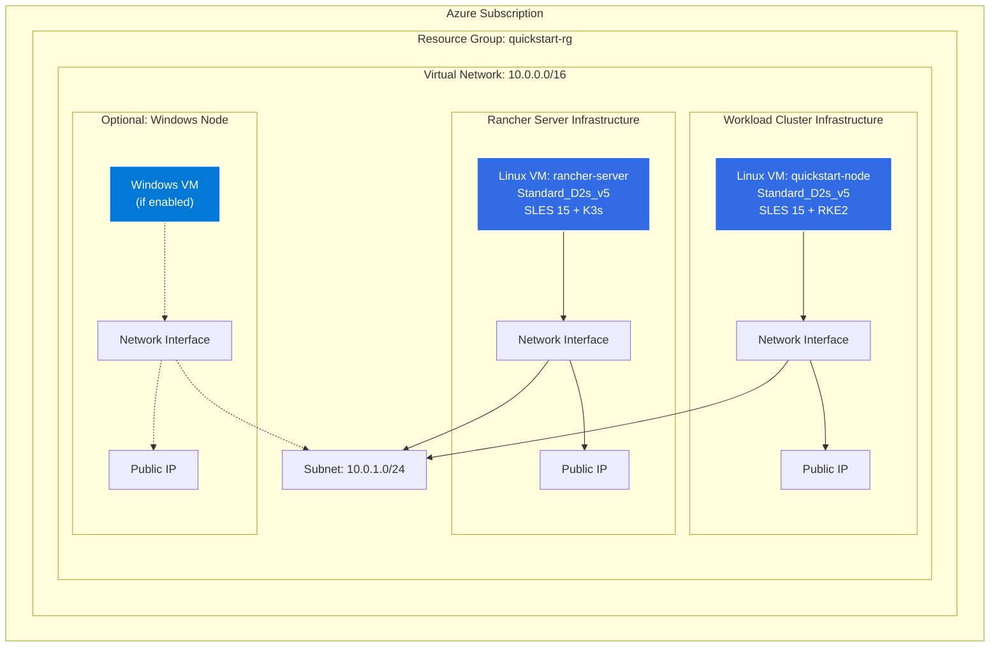

# Azure Rancher Quickstart

Two single-node Kubernetes clusters will be created from two linux virtual instances running SLES 15 and Docker.
Both instances will have wide-open security groups and will be accessible over SSH using the SSH keys
`id_rsa` and `id_rsa.pub`.

## Architecture Overview

### Azure Infrastructure Resources

This Terraform deployment creates the following Azure resources:



### Rancher Multi-Cluster Management Architecture

This diagram shows how Rancher Server can manage downstream clusters including AKS:

```mermaid
graph TB
    subgraph "Users & Access"
        admin["Administrator"]
        devops["DevOps Team"]
        dev["Developers"]
    end
    
    subgraph "Rancher Management Server"
        subgraph "Rancher Server VM (K3s)"
            rancher["Rancher UI/API<br/>Port 443"]
            auth["Authentication<br/>(Local/AD/SAML/OIDC)"]
            rbac["RBAC & Policies"]
            catalog["Helm Catalog"]
        end
    end
    
    subgraph "Managed Downstream Clusters"
        subgraph "Quickstart Workload Cluster"
            rke2["RKE2 Cluster<br/>(Created by Terraform)"]
            agent1["Rancher Agent"]
        end
        
        subgraph "Azure Kubernetes Service (AKS)"
            aks1["AKS Cluster 1<br/>Production"]
            aksagent1["Rancher Agent"]
        end
        
        subgraph "Additional AKS Clusters"
            aks2["AKS Cluster 2<br/>Development"]
            aksagent2["Rancher Agent"]
            
            aks3["AKS Cluster 3<br/>Staging"]
            aksagent3["Rancher Agent"]
        end
        
        subgraph "Other Cloud Providers"
            eks["Amazon EKS"]
            gke["Google GKE"]
            eksagent["Rancher Agent"]
            gkeagent["Rancher Agent"]
        end
    end
    
    subgraph "Centralized Management Features"
        monitoring["Monitoring<br/>(Prometheus/Grafana)"]
        logging["Logging<br/>(Loki/Elasticsearch)"]
        backup["Backup & DR"]
        security["Security Scanning"]
        gitops["GitOps Integration<br/>(Fleet)"]
    end
    
    admin --> rancher
    devops --> rancher
    dev --> rancher
    
    rancher --> auth
    auth --> rbac
    rancher --> catalog
    
    rancher ---|"Manages"| agent1
    rancher ---|"Manages"| aksagent1
    rancher ---|"Manages"| aksagent2
    rancher ---|"Manages"| aksagent3
    rancher ---|"Manages"| eksagent
    rancher ---|"Manages"| gkeagent
    
    agent1 --> rke2
    aksagent1 --> aks1
    aksagent2 --> aks2
    aksagent3 --> aks3
    eksagent --> eks
    gkeagent --> gke
    
    rancher --> monitoring
    rancher --> logging
    rancher --> backup
    rancher --> security
    rancher --> gitops
    
    monitoring -.->|"Collects Metrics"| aks1
    monitoring -.->|"Collects Metrics"| aks2
    logging -.->|"Aggregates Logs"| aks1
    gitops -.->|"Deploys Apps"| aks1
    gitops -.->|"Deploys Apps"| aks2
    
    style rancher fill:#0075A8,stroke:#fff,stroke-width:3px,color:#fff
    style aks1 fill:#0078D4,stroke:#fff,stroke-width:2px,color:#fff
    style aks2 fill:#0078D4,stroke:#fff,stroke-width:2px,color:#fff
    style aks3 fill:#0078D4,stroke:#fff,stroke-width:2px,color:#fff
    style rke2 fill:#326CE5,stroke:#fff,stroke-width:2px,color:#fff
    style eks fill:#FF9900,stroke:#fff,stroke-width:2px,color:#fff
    style gke fill:#4285F4,stroke:#fff,stroke-width:2px,color:#fff
```



## Key Benefits of Rancher Multi-Cluster Management

1. **Unified Control Plane**: Manage all Kubernetes clusters (AKS, EKS, GKE, on-prem) from a single interface
2. **Centralized Authentication**: Integrate with Active Directory, SAML, OIDC for consistent access control
3. **Multi-Tenancy**: Project-based isolation and RBAC across clusters
4. **Application Catalog**: Deploy applications consistently across all clusters using Helm charts
5. **Monitoring & Logging**: Centralized observability with Prometheus, Grafana, and log aggregation
6. **GitOps Workflows**: Use Fleet for continuous delivery across multiple clusters
7. **Security & Compliance**: Policy enforcement, security scanning, and compliance reporting
8. **Backup & Disaster Recovery**: Automated backup and restore capabilities

## Connecting AKS Clusters to Rancher

After deploying this quickstart, you can import existing AKS clusters:

1. **Create AKS Cluster** (if not exists):
   ```bash
   az aks create \
     --resource-group <rg-name> \
     --name <aks-cluster-name> \
     --node-count 3 \
     --enable-addons monitoring \
     --generate-ssh-keys
   ```

2. **Import to Rancher**:
   - Log into Rancher UI
   - Click "Cluster Management" → "Import Existing"
   - Select "Azure AKS"
   - Choose your Azure subscription
   - Select the AKS cluster to import
   - Apply the provided kubectl command to your AKS cluster

3. **Alternative - Register Generic Cluster**:
   - In Rancher UI: Cluster Management → Import Existing → Generic
   - Copy the registration command
   - Run on AKS cluster: `kubectl apply -f <registration-manifest>`

<!-- BEGIN_TF_DOCS -->
## Requirements

| Name | Version |
|------|---------|
| <a name="requirement_terraform"></a> [terraform](#requirement\_terraform) | >= 1.0.0 |
| <a name="requirement_azurerm"></a> [azurerm](#requirement\_azurerm) | 3.59.0 |
| <a name="requirement_local"></a> [local](#requirement\_local) | 2.4.0 |
| <a name="requirement_tls"></a> [tls](#requirement\_tls) | 4.0.4 |

## Providers

| Name | Version |
|------|---------|
| <a name="provider_azurerm"></a> [azurerm](#provider\_azurerm) | 3.59.0 |
| <a name="provider_local"></a> [local](#provider\_local) | 2.4.0 |
| <a name="provider_tls"></a> [tls](#provider\_tls) | 4.0.4 |

## Modules

| Name | Source | Version |
|------|--------|---------|
| <a name="module_rancher_common"></a> [rancher\_common](#module\_rancher\_common) | ../rancher-common | n/a |

## Resources

| Name | Type |
|------|------|
| [azurerm_linux_virtual_machine.quickstart-node](https://registry.terraform.io/providers/hashicorp/azurerm/3.59.0/docs/resources/linux_virtual_machine) | resource |
| [azurerm_linux_virtual_machine.rancher_server](https://registry.terraform.io/providers/hashicorp/azurerm/3.59.0/docs/resources/linux_virtual_machine) | resource |
| [azurerm_network_interface.quickstart-node-interface](https://registry.terraform.io/providers/hashicorp/azurerm/3.59.0/docs/resources/network_interface) | resource |
| [azurerm_network_interface.quickstart-windows-node-interface](https://registry.terraform.io/providers/hashicorp/azurerm/3.59.0/docs/resources/network_interface) | resource |
| [azurerm_network_interface.rancher-server-interface](https://registry.terraform.io/providers/hashicorp/azurerm/3.59.0/docs/resources/network_interface) | resource |
| [azurerm_public_ip.quickstart-node-pip](https://registry.terraform.io/providers/hashicorp/azurerm/3.59.0/docs/resources/public_ip) | resource |
| [azurerm_public_ip.quickstart-windows-node-pip](https://registry.terraform.io/providers/hashicorp/azurerm/3.59.0/docs/resources/public_ip) | resource |
| [azurerm_public_ip.rancher-server-pip](https://registry.terraform.io/providers/hashicorp/azurerm/3.59.0/docs/resources/public_ip) | resource |
| [azurerm_resource_group.rancher-quickstart](https://registry.terraform.io/providers/hashicorp/azurerm/3.59.0/docs/resources/resource_group) | resource |
| [azurerm_subnet.rancher-quickstart-internal](https://registry.terraform.io/providers/hashicorp/azurerm/3.59.0/docs/resources/subnet) | resource |
| [azurerm_virtual_machine_extension.join-rancher](https://registry.terraform.io/providers/hashicorp/azurerm/3.59.0/docs/resources/virtual_machine_extension) | resource |
| [azurerm_virtual_network.rancher-quickstart](https://registry.terraform.io/providers/hashicorp/azurerm/3.59.0/docs/resources/virtual_network) | resource |
| [azurerm_windows_virtual_machine.quickstart-windows-node](https://registry.terraform.io/providers/hashicorp/azurerm/3.59.0/docs/resources/windows_virtual_machine) | resource |
| [local_file.ssh_public_key_openssh](https://registry.terraform.io/providers/hashicorp/local/2.4.0/docs/resources/file) | resource |
| [local_sensitive_file.ssh_private_key_pem](https://registry.terraform.io/providers/hashicorp/local/2.4.0/docs/resources/sensitive_file) | resource |
| [tls_private_key.global_key](https://registry.terraform.io/providers/hashicorp/tls/4.0.4/docs/resources/private_key) | resource |

## Inputs

| Name | Description | Type | Default | Required |
|------|-------------|------|---------|:--------:|
| <a name="input_azure_client_id"></a> [azure\_client\_id](#input\_azure\_client\_id) | Azure client id used to create resources | `string` | n/a | yes |
| <a name="input_azure_client_secret"></a> [azure\_client\_secret](#input\_azure\_client\_secret) | Client secret used to authenticate with Azure apis | `string` | n/a | yes |
| <a name="input_azure_subscription_id"></a> [azure\_subscription\_id](#input\_azure\_subscription\_id) | Azure subscription id under which resources will be provisioned | `string` | n/a | yes |
| <a name="input_azure_tenant_id"></a> [azure\_tenant\_id](#input\_azure\_tenant\_id) | Azure tenant id used to create resources | `string` | n/a | yes |
| <a name="input_rancher_server_admin_password"></a> [rancher\_server\_admin\_password](#input\_rancher\_server\_admin\_password) | Admin password to use for Rancher server bootstrap, min. 12 characters | `string` | n/a | yes |
| <a name="input_windows_admin_password"></a> [windows\_admin\_password](#input\_windows\_admin\_password) | Admin password to use for the Windows VM | `string` | n/a | yes |
| <a name="input_add_windows_node"></a> [add\_windows\_node](#input\_add\_windows\_node) | Add a windows node to the workload cluster | `bool` | `false` | no |
| <a name="input_azure_location"></a> [azure\_location](#input\_azure\_location) | Azure location used for all resources | `string` | `"East US"` | no |
| <a name="input_cert_manager_version"></a> [cert\_manager\_version](#input\_cert\_manager\_version) | Version of cert-manager to install alongside Rancher (format: 0.0.0) | `string` | `"1.11.0"` | no |
| <a name="input_instance_type"></a> [instance\_type](#input\_instance\_type) | Instance type used for all linux virtual machines | `string` | `"Standard_DS2_v2"` | no |
| <a name="input_prefix"></a> [prefix](#input\_prefix) | Prefix added to names of all resources | `string` | `"quickstart"` | no |
| <a name="input_rancher_helm_repository"></a> [rancher\_helm\_repository](#input\_rancher\_helm\_repository) | The helm repository, where the Rancher helm chart is installed from | `string` | `"https://releases.rancher.com/server-charts/latest"` | no |
| <a name="input_rancher_kubernetes_version"></a> [rancher\_kubernetes\_version](#input\_rancher\_kubernetes\_version) | Kubernetes version to use for Rancher server cluster | `string` | `"v1.24.14+k3s1"` | no |
| <a name="input_rancher_version"></a> [rancher\_version](#input\_rancher\_version) | Rancher server version (format: v0.0.0) | `string` | `"2.7.9"` | no |
| <a name="input_workload_kubernetes_version"></a> [workload\_kubernetes\_version](#input\_workload\_kubernetes\_version) | Kubernetes version to use for managed workload cluster | `string` | `"v1.24.14+rke2r1"` | no |

## Outputs

| Name | Description |
|------|-------------|
| <a name="output_rancher_node_ip"></a> [rancher\_node\_ip](#output\_rancher\_node\_ip) | n/a |
| <a name="output_rancher_server_url"></a> [rancher\_server\_url](#output\_rancher\_server\_url) | n/a |
| <a name="output_windows-workload-ips"></a> [windows-workload-ips](#output\_windows-workload-ips) | n/a |
| <a name="output_workload_node_ip"></a> [workload\_node\_ip](#output\_workload\_node\_ip) | n/a |
<!-- END_TF_DOCS -->
